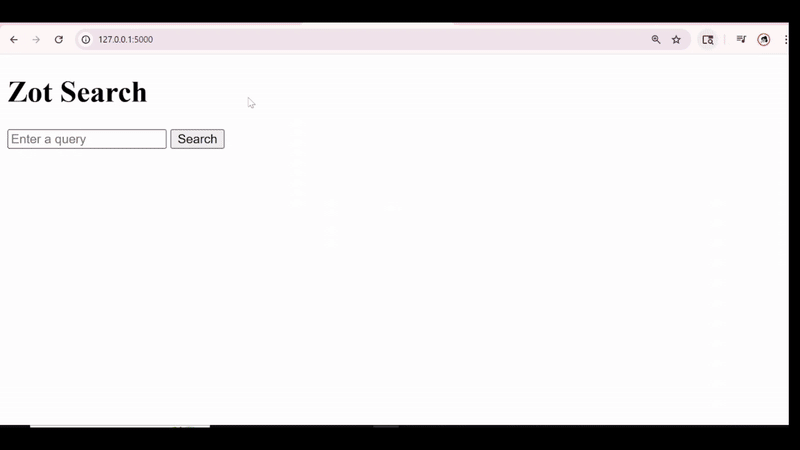

# :mag: ZOT SEARCH

## :open_book: OVERVIEW
Date: March 2025\
Developer(s): Ashneet Rathore, Nura Ahmed Nasir Abdalla\
Based on assignment instructions from Prof. Iftekhar Ahmed and Prof. Cristina Lopes

Zot Search is a domain-specific search engine for UCI ICS (University of California, Irvine Information and Computer Sciences), indexing 50,000+ departmental pages. The system consists of two components found in most modern search engines: an indexer, which processes and stores page content, and a retrieval system, which fetches results from the index and scores them for relevancy. Users can enter query terms and receive a ranked list of relevant results, with response times under 300 ms.

## :film_strip: DEMO


## :classical_building: ARCHITECTURE
Built in **Python**, the search engine's architecture prioritizes memory efficiency and fast query response times.

The indexer component of the search engine builds a complete **inverted index** from the downloaded corpus [(see Configuration #3)](#anchor-point). It extracts terms from pages using **tokenization** and **lemmatization**, creates partial inverted indexes on disk, and finally merges these indexes into a single index.

The question might arise *"Why create partial indexes only to merge them later?"*

Real-world search engines are designed to handle data far larger than what can fit in memory. Designed with **scalability** in mind, this search engine is implemented under the assumption that the entire inverted index cannot be held in memory at once. During index construction, the indexer periodically offloads the in-memory hash map to disk as partial indexes. Even when building the complete index, the indexer writes the hash map to a file whenever a specified memory threshold is reached.

The indexer is also responsible for computing and storing the relevancy score of each page for every term. This search engine uses a **TF-IDF-based ranking algorithm**, applying higher weights to text considered more important based off of HTML tags. For context, the completed inverted index is structured as a map of `(term → posting)` pairs, where each posting is itself a map of `(document id → relevancy score)` pairs.

The ranking and retrieval component relies on a **multi-level tiered index** structure - created during indexing - to achieve fast lookups. Alongside the complete index, the indexer also generated...
- An index of  `(character, [start position, end position])` pairs
- An index of `(term, position)` pairs

Here, positions represent the offsets in the next tier of the index file, allowing the system to quickly jump to the relevant range of entries instead of scanning the complete index from the very beginning. Conceptually, this algorithm is similar to binary search in that it significantly reduces the **search space** by eliminating irrelevant regions.

Think of the structure like this
- The complete index is the lowest tier, containing the actual postings.
- The term offset index is the middle tier, pointing into the complete index.
- The character offset index is the highest tier, pointing into the term offset index.

To illustrate how retrieval works, consider the query "career":

1. The retrieval system looks at the first character of the term "career", which is "c". Using the character offset index, it retrieves the associated start and end positions for "c". These positions essentially represent the range of terms starting with "c" in the term offset index file. Let's say the start and end positions for "c" are [100, 150].
2. The algorithm jumps to the position 100 in the term offset index file and scans line by line until it identifies the two terms in the term offset index that "career" falls between - for example, "cantral" and "carridin". Once these bounding terms are found, scanning terminates because the end position 150 only indicates the maximum possible range to consider. The positions associated with the bounding terms - let's say it's 4000 and 4300 - act as lower and upper bounds for searching in the completed inverted index.
3. The algorithm jumps to the lower bound position 4000 in the complete index and scans line by line until it finds the exact match for the term "career" or reaches the upper bound position 4300.

The retrieval system uses **OR query logic**, fetching a broad set of documents to maximize **recall**, while the relevancy scores computed by the indexer maximize **precision**. Together, recall and precision ensure that users receive results that are both complete and accurate. Retrieved documents are then ranked by relevance, with the most relevant pages appearing at the top. Finally, the results are sent to the **Flask** frontend and displayed to the user.

## :open_file_folder: PROJECT FILE STRUCTURE
```bash
ZotSearch/
│── app.py               # Launches Flask frontend and accepts queries
│── search.py            # Performs search, and ranks and returns results
│── inverted_index.py    # Builds the inverted index (preprocessing step)
│── templates/          
│   └── interface.html   # Renders the Flask frontend 
│── README.md            # Project documentation
│── .gitignore           # Excludes files and folders from version control
└── demo.gif             # GIF showing the searching demo
```

## :hammer: CONFIGURATION
**1. Clone the repository**
```bash
git clone https://github.com/ashneetrathore/ZotSearch.git
```

**2. Install the necessary libraries**
```bash
pip install nltk
pip install sortedcontainers
pip install beautifulsoup4
pip install ujson
```

<a name="anchor-point"></a>

**3. Download `developer.zip` from this [link](https://drive.google.com/file/d/1VDKl8NkZjRGGToOhHLVgtUEckZUxetwX/view?usp=sharing) to the project root directory and unzip it. This archive contains the full web page corpus for the search engine**
```bash
cd ZotSearch
unzip developer.zip
```

**4. Run the program that builds the inverted index**
```bash
python3 invertedindex.py
```

> [!TIP]
> `invertedindex.py` can take a couple hours to complete. To avoid interruptions, consider running it in the background using [`tmux`](https://linuxize.com/post/getting-started-with-tmux/) or another terminal multiplexer

**5. Once the program terminates, ```json``` and ```txt``` directories should exist in the project root, containing their respective files**

```bash
ZotSearch/
├── json/
│   ├── char_offsets.json      # Stores character offsets for fast searching
│   ├── partial_index1.json    # Stores partial index of terms
│   ├── partial_index2.json    # Stores partial index of terms
│   └── ...                    # Additional partial index files
├── txt/
│   ├── complete_index.txt     # Stores a merged index of all partial indices
│   ├── log.txt                # Records program execution details
│   ├── document_mapping.txt   # Maps document ids to urls
│   └── term_offsets.txt       # Stores term offsets for fast searching
└── ...
```

## :rocket: EXECUTION
Launch a local Flask web server
```bash
python3 app.py
```

> Open [http://127.0.0.1:5000](http://127.0.0.1:5000) in your browser to use the search engine.

## :wrench: TRY IT OUT
1. After opening the application in your browser, enter a query into the search bar and click `Search`.
2. The top 10 results will be displayed. Click on any of the links to view the page. To view additional pages beyond the top 10, click `Next` to load the next set of results.  
3. To access the full list of results without interface pagination, open `search_results.txt` located in the `txt` directory.
4. To check the query response time, open `time.txt` located in the `txt`directory.

> [!IMPORTANT]
> Some of the links may return 403/404 errors because the content provided in `developer.zip` may be outdated compared to the current version of those web pages.

Here are some sample query terms you can input:
- Architecture
- Artificial intelligence
- Bayesian model
- Capstone projects
- Career fair
- Compiler programming
- Constraint networks course
- Database systems
- Neuroscience
- Pythagorean theorem
- Probabilistic reasoning
- Reinforcement learning
- Security
- Software engineering degree